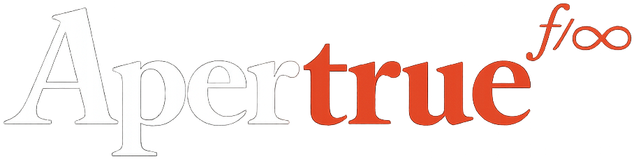
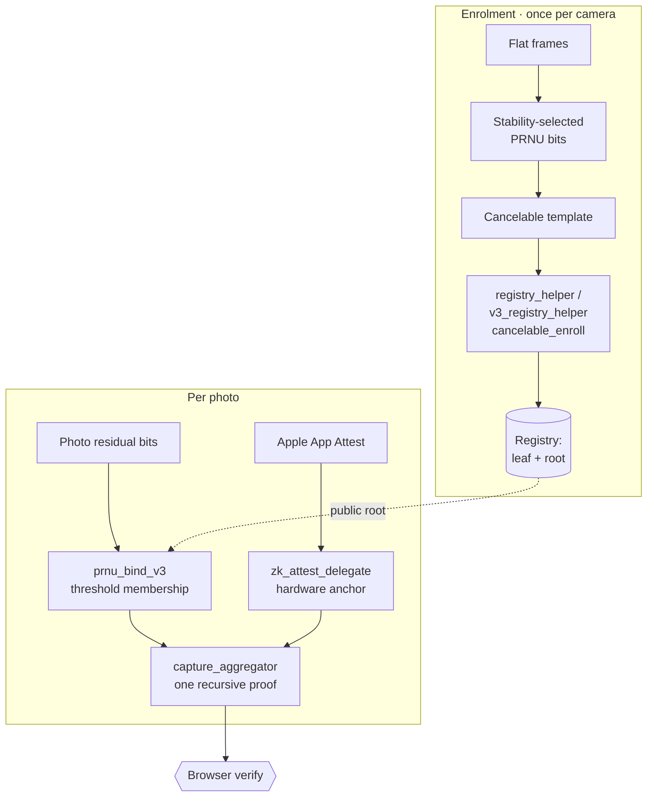

<p align="center">
  
</p>

<h3 align="center">Sensor Provenance · ZK Circuits</h3>

<p align="center">
  Zero-knowledge circuits that prove a photo came from a specific physical camera
  sensor — without revealing the sensor fingerprint. Written in <a href="https://noir-lang.org/">Noir</a>.
</p>

<p align="center">
  
  
  
  
</p>

---

Industry photo provenance signs a manifest at capture with a device or service key — a *signing* story. These circuits take the *sensor* road: provenance grounded in the camera's physical **PRNU** fingerprint, the fixed-pattern noise every image sensor imprints on its photos.

That fingerprint is a biometric: it leaks from every photo and cannot be reissued. So it is never registered or published directly. Each device registers a **keyed, revocable cancelable template** of its stability-selected PRNU bits, and every proof is an **anonymous set-membership** proof against a public registry root. A leaked template is retired by rotating a device-held key.

## Architecture



Enrolment runs once per camera and mints the registry entry. Every subsequent photo produces a per-photo proof; optionally the sensor-membership proof and the hardware-anchor proof are folded into a single recursive proof per capture.

## Circuits

### Per-photo proof

| Circuit | Proves | ~gates |
|---|---|---|
| `prnu_bind_v3` | the supplied residual bits are within threshold of a registered camera's enrolled bits — anonymous membership under a public registry root | ~170k |

### Fuzzy key extraction

| Circuit | Proves | ~gates |
|---|---|---|
| `prnu_key` | majority-decodes a stable key from stability-selected PRNU bits (code-offset repetition fuzzy extractor) | ~14k |
| `prnu_key_v2` | the same over the r=7 / 896-bit stability layout | ~29k |

### Enrolment (once per camera)

| Circuit | Proves | ~gates |
|---|---|---|
| `cancelable_enroll` | enrolment consistency over the keyed, revocable BioHash template; outputs the registered leaf | ~267k |
| `registry_helper` | key tier: computes the device Merkle leaf, root, and path | helper |
| `v3_registry_helper` | threshold tier: the same for the `prnu_bind_v3` leaf | helper |
| `enrollment_nullifier` | a one-time registration tag giving verbatim-duplicate refusal (not cross-enrolment identity) | ~29k |

### Hardware attestation

| Circuit | Proves | ~gates |
|---|---|---|
| `zk_attest` | an Apple App Attest attestation is valid, verified in-circuit (P-256) | ~321k |
| `zk_attest_delegate` | a per-capture hardware anchor via a delegated key — one Apple contact per device, ever | ~415k |
| `zk_attest_p384` | the P-384 variant of the attestation verification | variant |

### Aggregation

| Circuit | Proves | ~gates |
|---|---|---|
| `capture_aggregator` | recursively verifies the hardware anchor + sensor membership as one proof per capture, reconstructing the inner public values so every verifier check still holds | ~150k |

## Build

Each package is a standard [Nargo](https://noir-lang.org/docs/getting_started/quick_start) project:

```sh
cd prnu_bind_v3
nargo check
nargo compile
```

## Notes

- **The raw fingerprint never leaves the device.** Only cancelable templates (a keyed, lossy sign-of-random-projection transform) and Pedersen commitments are registered or published; none is invertible to the raw PRNU bits.
- **Anonymous by construction.** Per-photo proofs expose only a public registry root (set membership), not a device identifier.
- **Revocable.** A compromised template is retired by rotating the device-held transform key.
- `enrollment_nullifier` provides verbatim-duplicate refusal, not full Sybil resistance.

## License

[Apache-2.0](LICENSE). The vendored elliptic-curve code under `zk_attest*/src/crypto/noir_bigcurve_vendor/` is third-party under MIT; see the `VENDORED_FROM.md` beside it.
